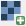
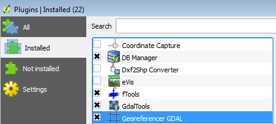
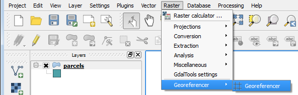
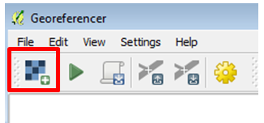
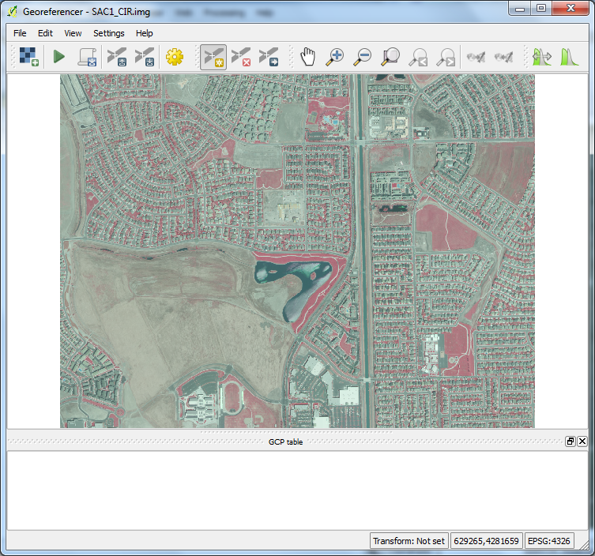
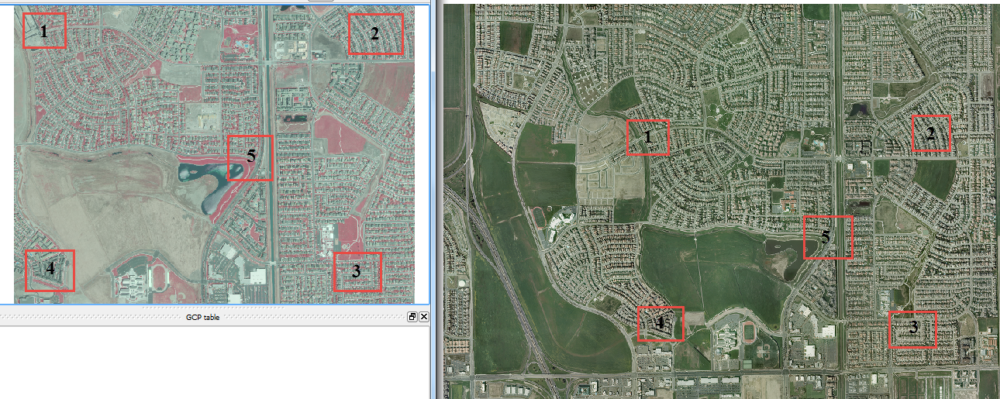
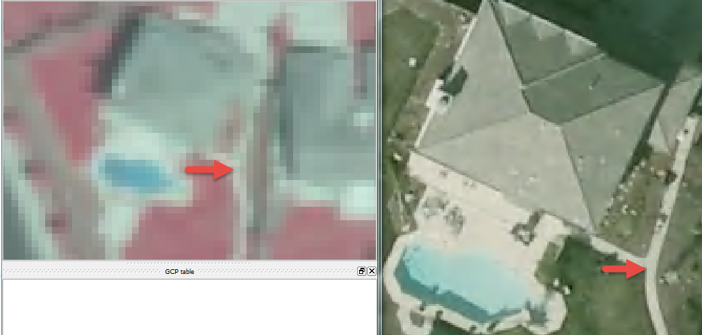
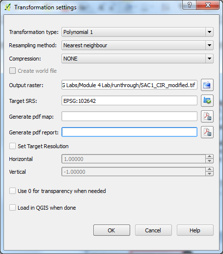
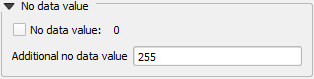

# GST 105: Introduction to Remote Sensing
## Lab 4: Image Rectification
### Objective – Perform an Image Rectification

Document Version: 8/27/2014

**FOSS4G Lab Author:**
Richard Smith, Ph.D.  
Texas A&M University - Corpus Christi

**Original Lab Content Author:**
Nathan Jennings

---

Copyright © National Information Security, Geospatial Technologies Consortium (NISGTC)

The development of this document is funded by the Department of Labor (DOL) Trade Adjustment Assistance Community College and Career Training (TAACCCT) Grant No.  TC-22525-11-60-A-48; The National Information Security, Geospatial Technologies Consortium (NISGTC) is an entity of Collin College of Texas, Bellevue College of Washington, Bunker Hill Community College of Massachusetts, Del Mar College of Texas, Moraine Valley Community College of Illinois, Rio Salado College of Arizona, and Salt Lake Community College of Utah.  This work is licensed under the Creative Commons Attribution 3.0 Unported License.  To view a copy of this license, visit http://creativecommons.org/licenses/by/3.0/ or send a letter to Creative Commons, 444 Castro Street, Suite 900, Mountain View, California, 94041, USA.  

This document was original modified from its original form by Richard Smith and continues to be modified and improved by generous public contributions.

---

### 1. Introduction

Although many photogrammetric processes described in the lecture require specialized photogrammetric software, this lab reviews how to perform an image rectification, which is one of the fundamental methods used in photogrammetry.  In a real-world setting additional training and education would be required in addition to an investment in photogrammetric software.  Many ortho imaging and analysis firms make the necessary investments to perform photogrammetric processes.

This lab includes the following tasks:

+ Task 1 – Set Up Referencing Environment
+ Task 2 – Select Common Control Points
+ Task 3 – Rectify the Image
+ Task 4 – Post-Rectification Steps

### 2. Objective: Perform an Image Rectification

Students will walk through the processes of conducting an image rectification using 2009 6” ortho rectified aerial photography to “rectify” a 2005 1m Color IR USGS image.

### 3. How Best to Use Video Walk Through with this Lab

To aid in your completion of this lab, each lab task has an associated video that demonstrates how to complete the task.  The intent of these videos is to help you move forward if you become stuck on a step in a task, or you wish to visually see every step required to complete the tasks.

We recommend that you do not watch the videos before you attempt the tasks.  The reasoning for this is that while you are learning the software and searching for buttons, menus, etc…, you will better remember where these items are and, perhaps, discover other features along the way.  With that being said, please use the videos in the way that will best facilitate your learning and successful completion of this lab.

### Task 1 – Set Up Referencing Environment

In this task, we will set up our referencing environment to prepare for image rectification.
To perform the image rectification, you will be using a QGIS Plugin and a reference image. Plugins are small add-ons to QGIS. Some are created by the core QGIS development team and others are created by third party developers.  The reference image will be used to pick control points and match them with the image we will be georeferencing.

**Note for Mac users:** *You will need to download and install the MrSID plugin from <http://j-vh.me/XfKiEd> (located about halfway down the page) to open .sid files (and, therefore, complete this lab).  Make sure you read the post-install read-me text file as you will need to create a free account at LizardTech, download an SDK, unzip and copy the files to the System Library GDAL folder.*

1.	Open QGIS Desktop 2.4.0.
2.	Click ‘Add Raster Layer’ button  and add ‘SAC_13.sid’ to the map canvas.

SAC_13.sid is a MrSID compressed image.  It is an ortho image from the City of Sacramento from 2009.  The pixel size is six inches and the coordinate system is NAD 1983 California State Plane II FIPS 0402 Feet, EPSG: 102642. This image will serve as the reference layer for our rectification.

Now we will enable the Georeferencer Plugin and toolbar.

3.	From the menu bar, choose Plugins -> Manage and Install Plugins
4.	The Plugins manager will open. Options along the left side allow you to switch between Installed, Not Installed, and Settings. The plugin you’ll use is a Core QGIS Plugin called Georeferencer GDAL. 
5.	Since it is a Core plugin it will already be installed. You just need to enable it. Click on Installed plugins and check the box next to Georeferencer GDAL (see figure below). Click Close.

6.	To open the Georeferencer plugin go to the menu bar choose Raster-->Georeferencer-->Georeferencer (see figure below).

7.	The Georeferencer window opens. Click the Open Raster button at the upper left hand side (see figure below).

8. Navigate to the lab folder and select the SAC1_CIR.img and click Open. *Note: If the Coordinate Reference System Selector window opens click Cancel to close. This dataset does not yet have an Earth-based coordinate system.*

SAC1_CIR.img is an image of Sacramento covering a smaller area than our reference image we loaded in Step 3 above.  It is in the ERDAS Imagine format with an undefined coordinate system as it is needing to be referenced.

You should now have the image to be rectified loaded as shown in the figure below.

9.	Arrange the Georeferencer window to the left of your screen (or, preferably a second monitor if you have one) so that you can see both the source image and the image to be rectified.  This will allow for easier identification of common points between images.  See Figure below for reference.

The referencing environment setup is now complete and we can move on to referencing the image.

### Task 2 - Select Common Control Points

In this task, we will rectify the SAC1_CIR.img image to the source SAC_13.sid image.  To do this, you will locate common features in each image and add control points in each image.  Typically, you should find mutually identifiable points in at least the four corners and center for the image for best results.  Only identifying points in one portion of the image will not yield optimal results, so it is best to spread the control points around the image as evenly as possible.  

The figure below illustrates where we will focus on finding common features in both images.

1.	Use the Zoom and Pan tools in both the Georeferencer window and the QGIS window to zoom to the upper-left corner of both images denoted as Area 1 in the figure above.
2.	Find a common reference point in both images.  The figure below shows an acceptable common reference point where a sidewalk forks in the backyard of a house with a pool.  
	+ Note:  You will likely need to zoom very close to the feature found in each feature.  Examples of acceptable common features can include permanent features such as street corners, bases of flag poles, bases of buildings (not the roof tops), etc.  The goal is to try and find the exact location in each image.

3. With a  common reference point located, in the Georeferencer windows, click ‘Add Point’ button 
.

4. Click on the image to be referenced on the common reference point.  Try and be accurate and precise with your click.  When you click on the image, the ‘Enter map coordinates’ dialog will appear (shown below).

5. Click ‘From map canvas’ button.  This will allow us to select a reference coordinate from the reference image rather than manually enter the coordinates.

6. Click on the exact same reference point location on the reference image on the QGIS map canvas.  Take care to click in the exact same location (or as close as you can get, resolution allowing).  When you do this, the ‘Enter map coordinates’ dialog will re-appear, but with the selected coordinates entered (see figure below for an example).

7. Click OK to accept the coordinates.  When you do this, the Ground Control Point (GCP) table will populate with the created control point (shown in the figure below).

The GCP table will contain a list of all control points that you created.  If you wish to remove a control point, you can right-click on its entry in the table, then choose ‘Remove’ from the contextual menu.  If you wish to keep the control point, but not apply it to the rectification, you can unselect the on/off box in the first column.  Additionally, if you wish to manually change any of the values, double-click on the cell you wish to change to make it editable.  

8. Repeat Steps 1-7 four more times to collect five control points.  Reference Figure 6 to determine where the areas where the control points should be located.  When you have completed this, you should have five points on both images, and five entries in your GCP table.  See the figure below for an example.

### Task 3 – Rectify the Image

Now that you have your control points set, we will move on to rectifying the image to the selected control points. 

1. To perform the rectification click the Start georeferencing   button  in the Georeferencer window.
2.	The Transformation settings window will open (see figure below). If beforehand you get a message saying ‘Please set transformation’ type click OK. 
	+ In the Transformation window choose the Polynomial 1 as the Transformation type.
	+ Choose Nearest neighbor as the Resampling method. This is the standard raster resampling method for discrete data such as a scanned map. 
	+ Click the browse button to the right of Output raster. Navigate to your Lab Folder and name the file SAC1_CIR_modified_spcs.tif.
	+ Click the browse button to the right of Target SRS. Type 102642 into the Filter and then double click the NAD_1983_StatePlane…0402_Feet CRS to make it the Selected CRS.
	+ Click OK to set the CRS.
	+ Click ‘Load in QGIS when done’.
	+ Click OK to perform the rectification.
 

When the rectification is performed, two things will happen. First, the rectified image will be added to the QGIS map canvas relative to the selected ground control points.  This is shown in the figure below.

The second thing that happens when the image is rectified, is the residual values will appear in the GCP table in the Georeferencer window.  This is shown in the figure below.  The dX and dY columns report the different in location between the reference image and the rectified image in pixels.  The residual column reports the residual value for the control point.  Below the GCP table is the transformation (rectification) mean error.

Ideally, you will try to obtain a residual value less than 0.5 pixel width or less than some small acceptable tolerance.  Additionally, ideally the mean error would be less than 2.0.

If the residual is less than 0.5 pixels and/or the mean error is less than 2.0, the rectified image is probably pretty good.  If the residual is greater than 0.5 pixels or the mean error is greater than 2.0, then delete or readjust the existing ground control to make the residual better.  Try taking more ground control point and see what effect this has on the residuals.

Notice that small changes and not “choosing the exact pixel” between the two images can have dramatic effect on the resulting residuals and hence the quality of the final rectified image output.

### Task 4 – Post-Rectification Steps
With the image successfully rectified to an acceptable residual, there are a few cleanup steps left to complete the rectification process: save ground control points, and remove the rectified image’s white border.

1.	In the Georeferencer window, click ‘Save GCP points as’ button  .  This will open a ‘Save GCP points’ dialog.
2.	Save the GCP points as SAC1_CIR.img.points in your lab directory.
3.	Click File->Quit to close the Georeferencer window.

The saved GCP points can be loaded in the Georeferencer window at a later time to re-rectify our image.  

Next, we will remove the white border around the image for display purposes.

4.	Open the Properties for the rectified image.
5.	Select the Transparency tab.
6.	Uncheck ‘No data value’.
7.	Enter ‘255’ as an Additional no data value (shown in the figure below).  255 represents the RGB code for white, which is the color we wish to exclude. 
8.	Click OK to set the no data value.  The white border will now be transparent.  
	+ Note: Typically, these borders are either white (RGB:255) or black (RGB:0), so choose the appropriate no data value when needed.

### 4. Conclusion

You have completed the fundamental image rectification process that is common throughout many photogrammetric processes.  Although image rectification is much more involved than this lab, the same principles of identifying and collecting high quality ground control that are then used to rectify image data is important.  In addition being able to review and determine how well the image rectification process and how to take subsequent steps to improve the output is equally important.

### 5. Discussion Questions

1.	Describe how the rectified image compares to the 2009 reference imagery.  How effective was the rectification?  How might you improve the rectification?
2.	What challenges did you face when choosing common control points between the two images?  What strategies did you employee to mitigate those challenges?
3.	Why did the white border show up on the rectified image when added to the QGIS map canvas?

