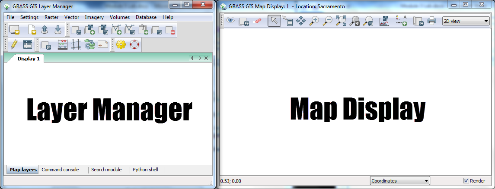
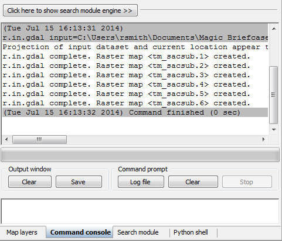
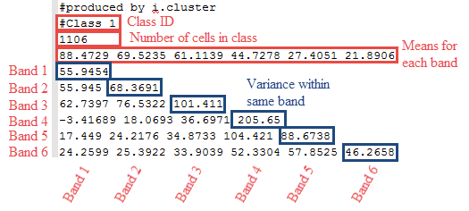
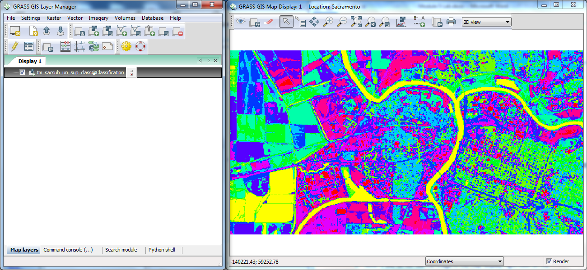
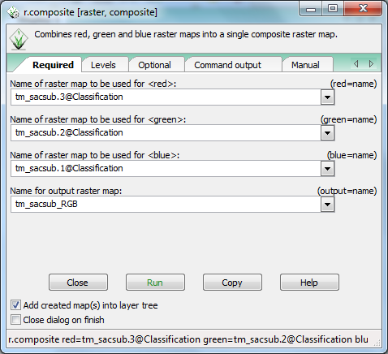
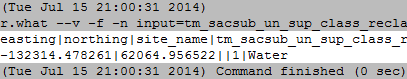

# GST 105: Introduction to Remote Sensing
## Lab 5: Unsupervised Classification
### Objective – Perform an Unsupervised Classification

Document Version: 8/27/2014

**FOSS4G Lab Author:**
Richard Smith, Ph.D.  
Texas A&M University - Corpus Christi

**Original Lab Content Author:**
Nathan Jennings

---

Copyright © National Information Security, Geospatial Technologies Consortium (NISGTC)

The development of this document is funded by the Department of Labor (DOL) Trade Adjustment Assistance Community College and Career Training (TAACCCT) Grant No.  TC-22525-11-60-A-48; The National Information Security, Geospatial Technologies Consortium (NISGTC) is an entity of Collin College of Texas, Bellevue College of Washington, Bunker Hill Community College of Massachusetts, Del Mar College of Texas, Moraine Valley Community College of Illinois, Rio Salado College of Arizona, and Salt Lake Community College of Utah.  This work is licensed under the Creative Commons Attribution 3.0 Unported License.  To view a copy of this license, visit http://creativecommons.org/licenses/by/3.0/ or send a letter to Creative Commons, 444 Castro Street, Suite 900, Mountain View, California, 94041, USA.  

This document was original modified from its original form by Richard Smith and continues to be modified and improved by generous public contributions.

---

### 1	Introduction ###

The unsupervised classification method is one of the two commonly used “traditional” image classification routines.  This method (and the supervised classification) is often used with medium (> 20m) and coarse (> 1km) resolution multispectral remotely sensed imagery.  More commonly the unsupervised and supervised classification methods are used together to form a hybrid image classification process to categorize pixels into land cover or land use types.

This lab includes the following tasks:

+ Task 1 – Define New GRASS Location and Mapset  
+ Task 2 – Learn GRASS Graphical User Interface and Concepts
+ Task 3 – Import and Group Imagery, and Set Region   
+ Task 4 – Perform Unsupervised Classification
+ Task 5 – Interpret Results
+ Task 6 – Challenge: Perform 15 Class Unsupervised Classification

###2	Objective: Perform an Unsupervised Classification

Students will be introduced to the unsupervised classification method.

QGIS and GRASS Tools do not provide access to GRASS’s classification functions, therefore, in this lab, the student will learn how to classify an image using the GRASS GIS Graphical User Interface (GUI).

A simple classification scheme will be used for the lab:

+ Water  
+ Agriculture  
+ Fallow  
+ Grassland  
+ Forest  
+ Urban  
+ Barren

###3	How Best to Use Video Walk Through with this Lab

To aid in your completion of this lab, each lab task has an associated video that demonstrates how to complete the task.  The intent of these videos is to help you move forward if you become stuck on a step in a task, or you wish to visually see every step required to complete the tasks.

We recommend that you do not watch the videos before you attempt the tasks.  The reasoning for this is that while you are learning the software and searching for buttons, menus, etc…, you will better remember where these items are and, perhaps, discover other features along the way.  With that being said, please use the videos in the way that will best facilitate your learning and successful completion of this lab.

###Task 1 Define New GRASS Location

In this task, we will define a new GRASS Location and Mapset to serve as our working environment for the unsupervised classification.  First, let’s briefly review a few storage concepts.  For a  more detailed overview, revisit Task 1 in Lab 3 for this course, or, read the GRASS GIS documentation at <http://grass.osgeo.org/">

In order for GRASS to start a project, it must first connect to a Database (also called a GISDBase or a GIS Data Directory).  The Database is simply a folder on your computer that has special sub directories.  Once GRASS connects to a Database, it then needs to access a Location.  A Location is a child directory of the Database and stores the coordinate system or map projection that all enclosed Mapsets will use.  A Mapset is a child directory of a Location that represents a geographical subset of its parent Location.  Mapsets contain geographic data in their directories.  There are two types of mapsets: Permanent and owner.  

Let’s create the Location and Mapset.

1.	Open GRASS 6.4.3 GUI.  In Windows, this can be found at Start->All Programs->QGIS Chugiak->GRASS GIS 6.4.3->GRASS 6.4.3 GUI

This will open the ‘Welcome to GRASS GIS’ window (shown in Figure 1) and possibly a command prompt.  You can ignore the command prompt for this exercise.  We will use this Welcome window to create our new location.

2.	Click Browse button and navigate to the ‘Lab 5 Data’ folder that you extracted to your hard drive.
3.	Create a new folder named ‘grassdata’ in your lab directory and select the new folder as the database.
4.	Click ‘Location wizard’ button on the ‘Welcome to GRASS GIS’ window.  This will open the ‘Define new GRASS Location’ wizard.
5.	Verify that the GIS Data Directory points to the lab directory.
6.	Set the Project Location and Location Title both to ‘Sacramento’.  
7.	Press Next.
8.	Select ‘Select EPSG code of spatial reference system’.
9.	Click Next.
10.	Search for EPSG code 3309.  Select 3309 NAD27 / California Albers.  (Shown in Figure 2).

11.	Click Next to set the CRS.  The ‘Select datum transformation’ window will appear.
12.	Choose ‘1: Used in whole nad27 region’ as the datum transformation.
13.	Click OK to set the datum transformation.
14.	Click Finish on the summary to return to the GRASS Welcome window.
	+ Note: If you receive a dialog telling you to change the default GIS data directory, press OK to dismiss.
15.	A dialog box named ‘Location <Sacramento> created’ will appear asking if we wish to set the default region extents and resolution now.  Click No.
16.	A dialog box named ‘Create new mapset’ will appear asking if we wish to create a new mapset.  Enter ‘Classification’, then press OK to create the mapset.

You should now have the Sacramento and two Mapsets created in the GIS Database (shown in the figure below).  We can now start  our GRASS GIS Project.

17.	Select ‘Classification’ from the Accessible mapsets list then click ‘Start GRASS’ button.  This will open the GRASS GUI.

###Task 2		Learn GRASS Graphical User Interface and Concepts

When the GRASS GUI program starts, you are presented with two separate windows: The Layer Manger and the Map Display (shown in the figure below).

The Layer Manager is composed of:

+ Menu Bar
+ Toolbars
+ Four Tabs
	+ Map layers
	+ Command console
	+ Search module
	+ Python shell

Let’s discuss these items in detail appropriate for what you will use in this lab.

+ Menu Bar – Provides access to all of GRASS’s functions.  In this lab, we will use the File, Settings, Raster, and Imagery menus.

+ Toolbars – Provides convenient access to commonly used GRASS functions.  We will not use any of these buttons for this lab, but, instead, will opt to use the Menu Bar.

+ Map layers tab – Manages the draw order and visibility of map layers.  We will use this to access information about loaded map layers.

+ Command console tab – Displays the output of commands that are run.  Also allows the user to type in commands to execute.  We will review output of command runs in this tab throughout this lab.

+ Search module tab – Similar to the GRASS Tools Modules Tree, it provides an hierarchical listing of all GRASS functions for logical browsing.  You can find modules by description, keyword, or command by using the filter box.  We will not use this tab in this lab.

+ Python shell tab -  Provides access to the Python interpreter for sending commands.  We will not use this tab in this lab.

Now let’s take a closer look at the Map Display.  It is composed of:

+ Toolbar – Provides access to the Map Display functions.  This is roughly analogous to the QGIS Map Canvas controls.  We will use this toolbar to explore map layers loaded in the Map layers tab of the Layer Manager window.

+ Information bar – Located along the bottom of the Map Display window, it displays a multitude of information depending on which option is selected in the dropdown box.  Map rendering can be enabled or disabled on this bar.  

The Layer Manager is the core part of the GRASS GUI as it provides access to all of GRASS’s functionality.  During this lab, we will access quite a few menu items from the Layer Manager to set up our analysis environment, and then view the results in the Map Display for interpretation and interaction.

One last note about GRASS’s modules.  A GRASS module (which I will refer to as a module, tool, or function) can be thought of as a small supporting program that can be executed to perform useful actions.  Examples of such actions are importing raster maps, rectifying images, creating composites, and performing an cluster analysis.

As we select modules to run, you will notice that the module names are preceded by a single letter and a dot (e.x. r.composite).  The single letter and dot, represents which category of actions the module belongs to.  Here is a listing of categories of actions and their associated single letters that we will use in this lab; other categories exist, but we will not access them in this lab.

+ g – General functions, such as file management, mapset management, and projection management.  These functions are primarily found in the Menu Bar under ‘File’, ‘Settings’, and ‘Help’.  

+ r – Raster related functions, such as importing rasters, terrain analysis, color management, and interpolation to name a few.  These functions are primarily found in the Menu Bar under ‘Raster’.  

+ v – Vector related functions, such as importing vectors, topology maintenance, feature queries, and attribute management.  These functions are primarily found in the Menu Bar under ‘Vector’.  

+ i – Imagery related functions, such as classification, image grouping, transformations, and filtering.  These functions are found in the Menu Bar under ‘Imagery’.

###Task 3 Import and Group Imagery, and Set Region

In this task, we will import the raster file that we will perform an unsupervised classification on, and create an image group.  This will prepare the imagery for input for classification.

1.	Click File->Import Raster Data->Common formats import [r.in.gdal].  This will open the ‘Import raster data’ module window.
2.	Set the following options (see the figure below for reference):
	+ Source Type: File  
	+ Source settings
		+ Format: Erdas Imagine Images (.img)  
		+ File: <lab directory>\tm_sacsub.img
	+ List of GDAL layers
		+ tm_sacsub.img: checked
>
>>d.	Add imported layers into layer tree: unchecked

3.	Click ‘Import’ button then click ‘Close’ button to close the dialog.
4.	Select the Layer Manager window and select the ‘Command console’ tab if it is not already selected (shown in the figure below). The console displays the results of the import function.  

Note that the tool imported six rasters; one raster for each raster band.  GRASS treats each band as a separate raster map.  Each band can be visualized separately, or, if desired, a composite can be created, such as the composite created in Lab 3 for this course.  

To perform an image classification, the raster maps (bands) must be combined in to a group and subgroup.  A group is a collection of raster maps.  A subgroup is a subset of the group’s raster maps that will be utilized in the image classification.  So, for instance, if you had a group of bands 1,2,3,4,5,6, but only wanted to use bands 3, and 4 for analysis, you would create a subgroup containing only bands 3 and 4.

When we imported tm_sacsub, GRASS created a group for us named ‘tm_sacsub’.  We will edit the group containing all 6 raster maps to add a subgroup containing all of the raster maps, since we will use all bands for our unsupervised classification.

5.	Click Imagery->Develop images and groups->Create/edit group [i.group].  This will open the ‘Create or edit imagery groups’ tool.
6.	Enter ‘tm_sacsub_group’ as the group  name in the top dropdown box.  The ‘Layers in selected group’ should automatically populate with the six tm_sacsub raster maps (see the figure below).
	+ If the layers do not populate, click ‘Add’ and check the boxes next to the six tm_sacsub.n maps.

7.	Check ‘Define also sub-group…’.
8.	Click OK to add the sub-group and dismiss the tool.

Now that the imagery has been loaded, and a group and subgroup have been specified, the last step is to set the region.  If you recall from Lab 3, a Region is a subset of a Location defined by a rectangular bounding box.  The Region is important for raster and imagery operations as it bounds the area (region) that will participate in any raster and imagery operations executed in GRASS.  A Region is an operating parameter set when working in GRASS.

Let’s set the region equal to one of the tm_sacsub raster maps.

9.	Click Settings->Region->Set region [region] on the Layer Manager window.  This will open the region tool.
10.	Set the following options:
	+ [multiple] Set region to match this raster map: tm_sacsub.1@Classification
		+ Note: The ‘@Classification’ denotes that tm_sacsub.1 is stored in the ‘Classification’ mapset.
11.	Click ‘Run’.  The tool will switch to the ‘Command output’ tab.  If you do not see any line that begins with the word ‘ERROR’, then the region has been successfully set.
12.	Click ‘Close’ to close the region tool.

With the imagery loaded, group and subgroup defined, and region set, we can now perform the unsupervised classification.

###Task 4		Perform Unsupervised Classification

In this task, we will perform an unsupervised classification using two tools: i.cluster, and i.maxlik.  Let’s get started.

1.	Click Imagery->Classify image->Clustering input for unsupervised classification [i.cluster] from the Layer Manager menu bar.  This will open the cluster tool.

To understand what a tool will do, it is important to refer to the tool’s manual.  Luckily for us, the majority of tools that opens in GRASS GUI have a ‘Manual’ tab that displays the tools’ manuals.  Let’s explore the i.cluster  manual now to understand how this tool works.

2.	Click ‘Manual’ tab in the cluster tool.  This will display the cluster tool’s manual.  You may want to maximize the window to view all of the manual’s content without having to scroll.
3.	Read the following manual sections:
	+ Name  
	+ Description  
	+ Parameters (second Parameters list under Description, which has more verbose descriptions).

Now that you have an understanding of what the tool will do, and the fact that it is the first of two steps of the unsupervised classification process (i.maxlik being the second), let’s set tool options to run the classification.

4.	Click ‘Required’ tab.
5.	Set the following options:  
	+ Name of input imagery group: tm_sacsub_group@Classification  
	+ Name of input imagery subgroup: tm_sacsub_group  
	+ Name for output file containing result signatures: cluster10  
	+ Initial number of classes: 10
6.	Click ‘Optional’ tab.  
	+ Name for output file containing final report: <lab folder>\cluster10_report
7.	Click ‘Run’ to execute the tool.  It will switch to the ‘Command output’ tab and display the results of the cluster tool (shown in the figure below).

8.	Review the Command output for any errors.  If there are errors, double-check the steps above and run the cluster tool again.

The cluster tool creates two files of interest to us: the result signatures file (cluster10), and the final report (cluster10_report).  Let’s view the cluster10_report to see what it contains.

9.	Open a text editor, such as Notepad and open <lab directory>\cluster10_report.  

This report contains detailed information about the results of the cluster tool as it iterated over the input subgroup multiple times to reach its convergence goal.   It reports the class means, standard deviations, class distribution, class separation, and how many classes were created.

10.	Take a few moments to review the cluster10_report.  Take note of the number of created classes (located at the bottom of the report).
11.	Close the cluster10_report.

Now let’s view the result (spectral) signatures file.

12.	Open a text editor, such as Notepad and open 
<lab_directory>\Sacramento\Classification\group\tm_sacsub_group\subgroup\tm_sacsub_group\sig\cluster10.   (Wow! What a long path!)  A portion of the cluster10 file is shown in the figure below.

The spectral signature file can be reviewed to see the signature statistics for each of the spectral classes that were created from the unsupervised classification process.  The spectral signature file shows a Class ID (the spectral class number, which are unknown cover types at this point), the number of cells in the class, the means for each set of pixels that make up the spectral class, and an associated covariance matrix.  The covariance matrix is a set of values that compare how similar or different the pixel values that make up the spectral class are between the image bands.  The diagonal values represent the variance for a set of pixels for the specific band number.  Large values indicate that the pixel values are different; small variance values indicate that the pixels values that make up the spectral class are similar (or are homogeneous).

The spectral signature file can be used in conjunction with reviewing different spectral classes within the image to help determine what other steps might need to be taken to make further refinements on the image classification.  The spectral signature file may help determine that a different unsupervised classification is needed that contains a larger number of spectral classes to be created.  The spectral signature file may also provide some insight on how similar or different some spectral classes are from one another and provide some insight where the individual spectral classes need to be merged.  The spectral differences between some cover types may not be large enough to separate out or identify one of the unique land cover types in the classification scheme.

The spectral signature file is another piece of information to an analyst that may provide some insight and the analyst can decide if creating and reviewing this file is worth the effort during the unsupervised classification process.  The spectral signature file will be discussed again in the supervised classification lab.

With the clustering complete, we can now move on to the second step of the unsupervised classification: running the i.maxlik tool.

13.	Click Imagery->Classify Image->Maximum likelihood classification (MLC) [i.maxlik].  This will open the MLC tool.
14.	Click the ‘Manual’ tab and read the manual for the MLC tool.  When you are done reading the manual, proceed to the next step.
15.	Click ‘Required’ tab and set the following options:  
	+ Name of input imagery group: tm_sacsub_group@Classification  
	+ Name of input imagery subgroup: tm_sacsub_group  
	+ Name of file containing signatures: cluster10  
	+ Name for raster map holding classification results: tm_sacsub_un_sup_class  
	+ Add created map(s) into layer tree: checked  
16.	Click ‘Run’ to execute the MLC tool. 
17.	Check the Command output for errors.  If none exist, click ‘Close’ to close the MLC tool.
18.	On the Layer Manager window, click Map layers.  You should see our classified image listed.  On the Map Display, you should see the classified image (shown in the figure below).  
	+ Note: if you do not see the image in the map display, right-click on the layer in the Map Layers list, and choose ‘Zoom to selected map(s)’ from the contextual menu.

With the classification completed, we will now move to interpreting the result.

###Task 5		Interpret Results

The resulting image (which represent spectral classes) was created without much involvement.  Next steps involve making sense of the result.  Generally, some of the spectral classes might make sense, but others are likely a mix of cover types.  Normally, some field work would be conducted or other data is available to help make some determinations in land cover types.  In addition, some manual processes to change groups of pixels can be expected.  The interpretation and revision of the results are often involved and can easily take weeks or months of time, not just days.

+ Look at the obvious.

Water often times is represented as a single class or maybe two classes.  To make it easier for us to understand what the classes are representing, let’s add a color composite of tm_sacsub to the map display for comparison purposes.

1.	Click Raster->Manage colors->Create RGB [r.composite]. This will open the composite tool.
2.	Set the following options (shown in Figure 11):  
	+ Name of raster map to be used for <red>: tm_sacsub.3@Classification  
	+ Name of raster map to be used for <green>: tm_sacsub.2@Classification  
	+ Name of raster map to be used for <blue>: tm_sacsub.1@Classification  
	+ Name for output raster map: tm_sacsub_RGB  
	+ Add created map(s) into layer tree: checked
3.	Click ‘Run’ to execute the composite tool.

4.	If no errors are shown in the Command output, click ‘Close’ to close the tool.
5.	View the Map Display.  Note that you can now see the true color composite.  Let’s have it draw underneath the classification image.
6.	In the Layer Manager, drag tm_sacsub_un_sup_class above tm_sacsub_RGB to rearrange the draw order.  You should now see the classified image in the Map Display.
7.	Toggle the visibility of the classified image by checking and unchecking the checkbox next to the layer name in the Layer Manager.  While toggling the visibility, determine which color represents the water features.

Now that you have identified which color represents water (yellow in our example’s case (see the figure above of cluster10 Result File Showing First Class), let’s determine which class in the raster represents water.

8.	In the Layer Manager, select tm_sacsub_un_sup_class, then in the Map Display, click ‘Query raster/vector maps’ button  .
9.	Click on a cell in the Map Display that represents water features.  
10.	Open the Command console tab on the Layer Manager.  This will display the results of our query.  In our case, Class 1 represents water features (shown in the figure below).

Now that we know that Class 1 represents water features, let’s only apply a color to that class to easily see where water was identified.

11.	Click Raster->Manage colors->Color tables [r.colors].  This will open the color tables tool.
12.	Click on the Manual tab and read the following sections:  
	+ Name  
	+ Description  
	+ Examples
13.	Click ‘Required’ tab.  
14.	Set ‘Name of input raster map’ to tm_sacsub_un_sup_class.
15.	Click ‘Colors’ tab.
16.	In ‘or enter values interactively’, enter:  
1 yellow  
default grey
17.	Press ‘Run’ to set the color table.  You should see the figure below displayed in the Map Display.

")

Most of the Spectral Class 1 falls along the river and is likely correct; however, some pixels in class 1 fall on agricultural fields in the South West corner.

When an image analyst is evaluating and trying to determine the land cover types in an unsupervised classification, it can be useful to label the spectral classes to prospective land cover types.

NOTE:  Most of the spectral classes will not represent a single land cover class.  This is because a human creates the land cover classification scheme whereas the unsupervised classification is categorizing pixels into similar spectral groups (which may or may not relate to specific land cover types).

Since the land cover types are not know when the unsupervised classification completes additional work and investigation is required to refine the spectral classes into specific land cover types.  To make a “first attempt” at determining the land cover types, the analyst can label possible land cover types for each spectral class.

For Spectral Class 1, since this category seems to represent Water cover types, this spectral class can be labeled “Water”.

Now that we know that Class 1 represents water, let’s re-colorize all classes, then change the class label from ‘1’ to ‘Water’.

18.	Using the r.color tool opened in Step 1 above, clear the ‘or enter values interactively’ values on the ‘Colors’ tab.
19.	For ‘Type of color table’, choose ‘rainbow’.  This will revert the classified image back to its original colors.
20.	Click ‘Close’ to close the r.color tool.
21.	Click Raster->Change category values and labels->Reclassify [r.reclass].
22.	Click on the ‘Manual’ tab and read the manual to understand what this tool does.
23.	Set the following options:  
	+ Required tab  
		+ Raster map to be reclassified: tm_sacsub_un_sup_class  
		+ Name for output raster map: tm_sacsub_un_sup_class_reclass  
		+ Add created map(s) into layer tree: checked
	+ Optional tab (shown in Figure 14)
		+ Or enter values interactively:  
		1 = 1 Water  
		\* = *

>>>>
 
24.	Click ‘Run’ to reclassify the raster.
25.	Click ‘Close’ to close the tool.

You probably noticed that the newly added reclassified layer looks exactly the same as the original raster.  That is normal.  What has changed is the class label.  Let’s see what changed.

26.	In the Layer Manager, select tm_sacsub_un_sup_class_reclass, then in the Map   Display, click ‘Query raster/vector maps’ button .
27.	Click on a Water feature cell then inspect the Command console to see what was returned (shown in the figure below).

Reclassifying the raster map makes it more intuitive when trying to understand or query the layer in future operations.

The other classes can be assigned in a similar fashion.  

28.	Use the methods above to turn on/off other layers and review the geographic extent to determine if one or more land cover types make up the spectral class.
29.	Assign the a useful name for each spectral class. 
30.	Provide a list of land cover types assigned to the 10 classes in the classified image.  **Submit this list for Discussion Question 1 in Part 6 of this lab.**

This can be time consuming and often takes some serious review and visual analysis and consultation of “ancillary” or reference data and often field work.

To get more practice, work on some of the other classes using the same methods to label the spectral classes at this point.  No additional ancillary information exists to continue this exercise.  

Students not familiar with the Sacramento area can use Google Maps or Google Earth to review high resolution image data that can help assign the spectral classes to prospective land cover types.

###Task 6		Challenge: Perform a 15 Class Unsupervised Classification

Perform another unsupervised classification on the same data, however, this time, use 15 classes instead of 10.  Assign land cover classes in the same manner as above, perhaps combing a few classes together (if appropriate) using the r.reclass tool.

Discuss the following:

1.	Briefly describe your observations of assigning land cover types to the spectral classes.
2.	Compare the two image classification results (after the land cover types have been assigned).  Assign useful colors to each classified image and provide screen shots of each of your colorized image classifications.  Use the first land cover type to assign a color if you have multiple land cover labels for a single spectral class.   Describe some of the similarities and differences.  Do you think either resulting image classification is better than the other is?  Describe.

###5	Conclusion

This completes the unsupervised classification process.  Students have learned how to implement the unsupervised classification as well as observe some of the issues and additional work that is required to refine and improve the unsupervised classification.

###6	Discussion Questions

1.	Submit the 10 class land types you assigned in Task 5 **highlighted above**.
2.	When working on assigning the 10 land types to the 10 classes in Task 5, **highlighted above**, briefly summarize the observations discovered when assigning the land types.
3.	Find, learn, and use the i.historgram tool on the reclassified raster.  Describe what the historgram is displaying and how it might be a useful visualization for interpreting the classification results.
