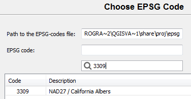
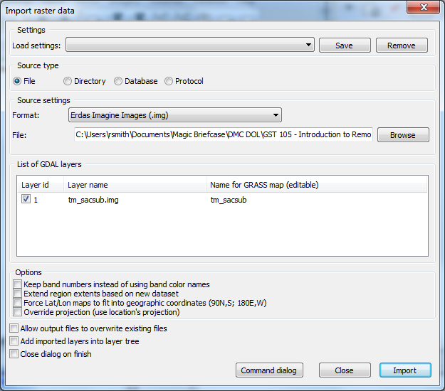
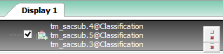
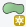
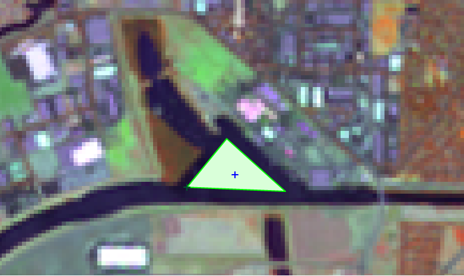
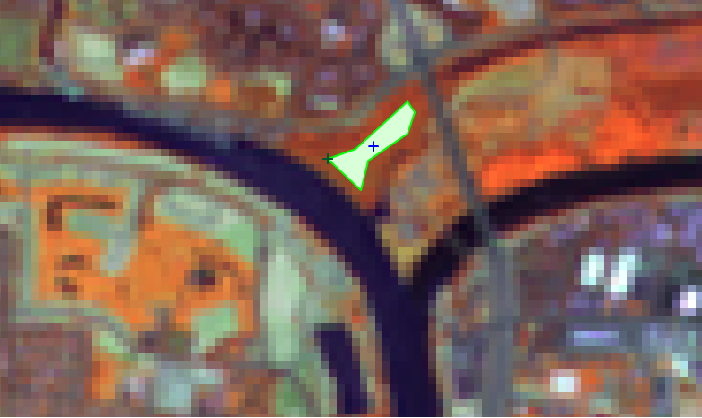
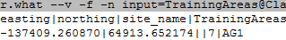
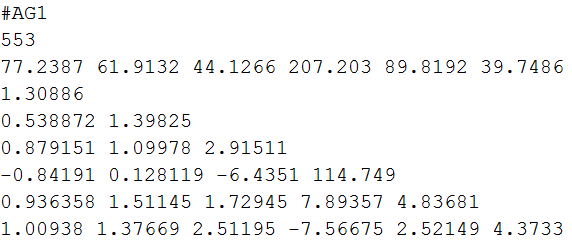

# GST 105: Introduction to Remote Sensing
## Lab 6: Supervised Classification
### Objective – Perform  Supervised Classification

Document Version: 8/27/2014

**FOSS4G Lab Author:**
Richard Smith, Ph.D.  
Texas A&M University - Corpus Christi

**Original Lab Content Author:**
Nathan Jennings

---

Copyright © National Information Security, Geospatial Technologies Consortium (NISGTC)

The development of this document is funded by the Department of Labor (DOL) Trade Adjustment Assistance Community College and Career Training (TAACCCT) Grant No.  TC-22525-11-60-A-48; The National Information Security, Geospatial Technologies Consortium (NISGTC) is an entity of Collin College of Texas, Bellevue College of Washington, Bunker Hill Community College of Massachusetts, Del Mar College of Texas, Moraine Valley Community College of Illinois, Rio Salado College of Arizona, and Salt Lake Community College of Utah.  This work is licensed under the Creative Commons Attribution 3.0 Unported License.  To view a copy of this license, visit http://creativecommons.org/licenses/by/3.0/ or send a letter to Creative Commons, 444 Castro Street, Suite 900, Mountain View, California, 94041, USA.  

This document was original modified from its original form by Richard Smith and continues to be modified and improved by generous public contributions.

---

### 1	Introduction

The Supervised classification method is another of the two commonly used “traditional” image classification routines.  This method (as well as the unsupervised method) is often used with medium (> 20m) and coarse (> 1km) resolution multispectral remotely sensed imagery.  More commonly the unsupervised and supervised classification methods are used together to form a hybrid image classification process to categorize pixels into land cover or land use types.

The primary difference between the unsupervised and the supervised methods is the supervised classification process requires a spectral signature file (sometimes referred to as the “training samples” or “training signatures”).  Creating and evaluating spectral signatures were discussed in the lecture material.  This lab will provide an opportunity for student learn how to create and evaluate spectral signatures that can be used in a supervised image classification.

This lab includes the following tasks:

+ Task 1 – Define New GRASS Location
+ Task 2 – Import and Group Imagery, and Set Region
+ Task 3 – Create Training Dataset
+ Task 4 – Perform Supervised Classification
+ Task 5 – Reclassify Spectral Classes to Information Classes
+ Task 6 – Challenge: Perform a Second Class Supervised Classification

### 2 Objective: Perform a Supervised Classification

Students will be introduced to the supervised classification method.

QGIS and GRASS Tools do not provide access to GRASS’s classification functions, therefore, in this lab, the student will learn how to classify an image using the GRASS GIS Graphical User Interface (GUI).

The primary objectives of this lab are:

1.	Create and Evaluate Spectral Signatures
2.	Perform a Supervised Classification
3.	Recode Spectral Classes to Information Classes

A simple classification scheme will be used for the lab:

+ Water  
+ Agriculture  
+ Grassland  
+ Forest  
+ Urban

### 3	How Best to Use Video Walk Through with this Lab

To aid in your completion of this lab, each lab task has an associated video that demonstrates how to complete the task.  The intent of these videos is to help you move forward if you become stuck on a step in a task, or you wish to visually see every step required to complete the tasks.

We recommend that you do not watch the videos before you attempt the tasks.  The reasoning for this is that while you are learning the software and searching for buttons, menus, etc…, you will better remember where these items are and, perhaps, discover other features along the way.  With that being said, please use the videos in the way that will best facilitate your learning and successful completion of this lab.

### Task 1		Define New GRASS Location

In this task, we will define a new GRASS Location and Mapset to serve as our working environment for the unsupervised classification.

Let’s create the Location and Mapset.

1.	Open GRASS 6.4.3 GUI.  In Windows, this can be found at Start->All Programs->QGIS Chugiak->GRASS GIS 6.4.3->GRASS 6.4.3 GUI

This will open the ‘Welcome to GRASS GIS’ window (shown in the figure below) and possibly a command prompt.  You can ignore the command prompt for this exercise.  We will use this Welcome window to create our new location.

2.	Click Browse button and navigate to the ‘Lab 6 Data’ folder that you extracted to your hard drive.
3.	Create a new folder named ‘grassdata’ in your lab directory and select the new folder as the database.
4.	Click ‘Location wizard’ button on the ‘Welcome to GRASS GIS’ window.  This will open the ‘Define new GRASS Location’ wizard.
5.	Verify that the GIS Data Directory points to the lab directory.
6.	Set the Project Location and Location Title both to ‘Sacramento’.  
7.	Press Next.
8.	Select ‘Select EPSG code of spatial reference system’.
9.	Click Next.
10.	Search for EPSG code 3309.  Select 3309 NAD27 / California Albers.  (Shown in figure below).

11.	Click Next to set the CRS.  The ‘Select datum transformation’ window will appear.
12.	Choose ‘1: Used in whole nad27 region’ as the datum transformation.
13.	Click OK to set the datum transformation.
14.	Click Finish on the summary to return to the GRASS Welcome window.
	+ Note: If you receive a dialog telling you to change the default GIS data directory, press OK to dismiss.
15.	A dialog box named ‘Location <Sacramento> created’ will appear asking if we wish to set the default region extents and resolution now.  Click No.
16.	A dialog box named ‘Create new mapset’ will appear asking if we wish to create a new mapset.  Enter ‘Classification’, then press OK to create the mapset.

You should now have the Sacramento and two Mapsets created in the GIS Database (shown in the figure below).  We can now start  our GRASS GIS Project.

17.	Select ‘Classification’ from the Accessible mapsets list then click ‘Start GRASS’ button.  This will open the GRASS GUI.

### Task 2		Import and Group Imagery, and Set Region

In this task, we will import the raster file that we will perform a supervised classification on, and create an image group.  This will prepare the imagery for input for classification.

1.	Click File->Import Raster Data->Common formats import [r.in.gdal].  This will open the ‘Import raster data’ module window.
2.	Set the following options (see figure below for reference):  
	+ Source Type: File  
	+ Source settings
		+ Format: Erdas Imagine Images (.img)    
		+ File: <lab directory>\tm_sacsub.img    
	+ List of GDAL layers
		+ tm_sacsub.img: checked
	+ Add imported layers into layer tree: unchecked

3.	Click ‘Import’ button then click ‘Close’ button to close the dialog.
4.	Select the Layer Manager window and select the ‘Command console’ tab if it is not already selected (shown in figure below). The console displays the results of the import function

Note that the tool imported six rasters; one raster for each raster band.  GRASS treats each band as a separate raster map.  Each band can be visualized separately, or, if desired, a composite can be created, such as the composite created in Lab 3 for this course.  

To perform an image classification, the raster maps (bands) must be combined in to a group and subgroup.  A group is a collection of raster maps.  A subgroup is a subset of the group’s raster maps that will be utilized in the image classification.  So, for instance, if you had a group of bands 1,2,3,4,5,6, but only wanted to use bands 3, and 4 for analysis, you would create a subgroup containing only bands 3 and 4.

When we imported tm_sacsub, GRASS created a group for us named ‘tm_sacsub’.  We will edit the group containing all 6 raster maps to add a subgroup containing all of the raster maps, since we will use all bands for our unsupervised classification.

5.	Click Imagery->Develop images and groups->Create/edit group [i.group].  This will open the ‘Create or edit imagery groups’ tool.
6.	Enter ‘tm_sacsub_group’ as the group  name in the top dropdown box.  The ‘Layers in selected group’ should automatically populate with the six tm_sacsub raster maps (see figure below).  
a.	If the layers do not populate, click ‘Add’ and check the boxes next to the six tm_sacsub.n maps.

7.	Check ‘Define also sub-group…’.
8.	Click OK to add the sub-group and dismiss the tool.

Now that the imagery has been loaded, and a group and subgroup have been specified, the last step is to set the region.  If you recall from Lab 3, a Region is a subset of a Location defined by a rectangular bounding box.  The Region is important for raster and imagery operations as it bounds the area (region) that will participate in any raster and imagery operations executed in GRASS.  A Region is an operating parameter set when working in GRASS.

Let’s set the region equal to one of the tm_sacsub raster maps.

9.	Click Settings->Region->Set region [region] on the Layer Manager window.  This will open the region tool.
10.	Set the following options:  
	+ [multiple] Set region to match this raster map:>>>tm_sacsub.1@Classification
		+ Note: The ‘@Classification’ denotes that tm_sacsub.1 is stored in the ‘Classification’ mapset.
11.	Click ‘Run’.  The tool will switch to the ‘Command output’ tab.  If you do not see any line that begins with the word ‘ERROR’, then the region has been successfully set.
12.	Click ‘Close’ to close the region tool.

With the imagery loaded, group and subgroup defined, and region set, we can now perform the unsupervised classification.

### Task 3		Create Training Dataset

In this task, we will perform a supervised classification.  There are two steps when performing a supervised classification: training, and classification.  In the training step, a training dataset is created that classifies sample portions of the input imagery.  This training dataset will then be passed to step two where it will be used when determining how to classify the image.  You can think of it as the user (you) showing the computer a few examples of how you would like have the image classified, and then letting the computer rely on your examples to classify the rest of the image based on what it learned from you.

For the first step, training, we will create a new vector map and digitize a few sample areas of the image and set the classes we wish to have similar areas classified as when the computer performs the supervised classification.  Next, we will convert the vector map to a raster map which will then be pass to step two for use in classification.  Let’s perform the training step now.

1.	Click Vector->Develop vector map->Create new vector map from the Layer Manager menu bar.  This will open the ‘Create new vector map’ dialog.
2.	Set the following options:  
	+ Name: Training  
	+ Create attribute table: checked  
		+ Key column: category        
	+ Add created map into layer tree: checked
3.	Click OK to create the Training vector map and add it to the layer tree.
4.	In the layer tree, right-click on the Training vector map and choose ‘Show attribute data’ from the contextual menu.  This will open the ‘GRASS GIS Attribute Table Manager’ window which allows for display, query, and modification of the vector map’s attribute table.
5.	Click ‘Manage tables’ tab.  This tab allows us to create, remove, and rename attribute table columns.  We will create a new column to store the description of the categories that we will assign to our training dataset.
6.	In the ‘Add column’ section, create a new column with the following properties (as shown in the figure below):  
	+ Column: Descr  
	+ Type: varchar  
	+ Length: 10
7.	Click Add button to create the column.  The new column will appear in the Table list.  If you make a mistake, you can right-click on a column and choose ‘Drop selected column’ to delete it from the table.

8.	Click Quit button to close the table manager.
Now that we have the vector map created, we need to display the raster map that we wish to digitize our training areas from.  Instead of creating a new raster composite, we will create a new, temporary RGB display raster.

9.	In the Layer Manager, click ‘Add various raster map layers’ button   then select ‘Add RGB map layer’ from the contextual menu.  This will open the d.rgb tool.
10.	Set the following parameters:  
	+ Required tab:  
		+ Name of … ‘red’: tm_sacsub.4@Classification  
		+ Name of … ‘green’: tm_sacsub.5@Classification  
		+ Name of … ‘blue’: tm_sacsub.3@Classification  
11.	Click OK button to create the RGB temporary raster overlay and add it to the map layers list (shown in figure below).

Note: The Training@Classification vector map may be hidden behind the RGB raster overlay in the map layers list (shown in figure below).  If this happens, simply click on a different tab in the Layer Manager window, then click back to the ‘Map layers’ tab.

12.	Drag the Training@Classification map above the raster overlay in the map layers list to have the vector map display on top of the raster map (you won’t notice a difference now, but you will when we start editing the vector map).

Now we are set to create our training dataset.  In our training dataset, we will create five training records for five classes (agriculture, water, grass, forest, urban).  We will then evaluate the spectral signatures, and then add additional spectral signatures.

13.	In the map layers list, right-click on Training@Classification and choose ‘Start editing’ from the contextual menu.  This will enable and display the digitizer toolbar in the Map Display window (shown in "RGB Raster Overlay in Map Display and Map Layers List" figure).

We will use this toolbar to create new training areas and set the Category and Descr attributes to the appropriate values.

14.	Zoom to the field shown in Figure 9.  This is an agriculture field we will specify as our first training area.

15.	Click ‘Digitize new area’ button   on the Digitizer toolbar.  This selects the tool.  

In general, the tools on the Digitizer toolbar perform actions with a left-click, undo actions with a  control-click, and confirm/complete actions with a  right-click.  Therefore, to create an area with four vertices, we would left-click five times to place the four vertices and the fifth vertex at the same location as the first vertex (to close the area), then right-click to complete the area.

16.	Using the figure below as a guide, left-click four times to create the four vertices for the area, then left-click a fifth time on top of the first vertex to close the area, then right-click to complete the area.  When the area is created, the ‘Define attributes’ dialog will appear.

17.	In the ‘Define attributes’ dialog, set the ‘Descr’ attribute value to ‘AG1’.
18.	Click ‘Submit’ button to save the attribute and close the window.  If the window does not close, click ‘Cancel’ button.
19.	Create four more training areas using the next 4 figures as guides. Set the descriptions of these training areas to ‘Water1’, ‘Grass1’, ‘Forest1’, and ‘Urban1’ respectively (descriptions also shown in Figure captions).

If you make a mistake when digitizing, you can use the ‘Delete feature(s)’ tool !Delete feathers tool](/figures/Delete_feature(s)_tool.png "[: Delete features tool")  to remove unwanted features.  To use the tool, first, left-click on the outline (or line, or vertex) of the feature you wish to remove, then right-click to confirm and complete the delete action.

20.	When you have completed digitizing all five training areas, click ‘Quit digitizer’ button .

21.	Click ‘Yes’ to the ‘Save changes?’ dialog to save your digitized training areas.  The digitized areas will now display in a bland grey color letting you know that they have been saved to the vector map.

With the vector training map completed, the next step is to convert it to a raster map so it can be used for input into the first pass (i.gensig) of the supervised classification process. 

22.	Click Vector->Map type conversions->Vector to raster (v.to.rast) on the Layer Manager window.  This will open the v.to.rast tool.
23.	Set the following parameters:  
	+ Required tab:  
	 	+ Name of input vector map: Training@Classification  
		+ Name for output raster map: TrainingAreas  
		+ Source of raster values: attr    
	+ Attributes tab:  
		+ Name of column for ‘attr’ parameter: category  
		+ Name of column...category labels: Descr  
	+ Add created map(s) into layer tree: checked
24.	Click ‘Run’ button to execute the tool then close the tool.  The TrainingAreas raster will be added to the map layers list and displayed in the Map Display (see figure below for example).  

The TrainingAreas raster map is displaying the NULL cells as white and is obscuring our view of the underlying imagery.  We will make the NULL cells transparent so we can see where the training areas lay on top of the imagery.

25.	Right-click on TrainingAreas in the map layers list then  choose Properties from the contextual menu.
26.	Click ‘Null cells’ tab.
27.	Check ‘Overlay (non-null values only).
28.	Click ‘OK’ button to apply and close the dialog.

The NULL cells will now be transparent and the two raster maps will be displayed together (as shown in the figure below).

29.	In the Map Display, click 'Query raster/vector maps button'  button to select the tool.  This tool will display the attributes of the raster or vector that you click on the map display.
30.	Click on one of the training areas to display its attributes.  When you do this, in the Layer Manager, the ‘Command console’ tab will activate and the result of the Query tool will display (example figure below).  What you should verify is that the category and Descr are stored in the training area properly (example circled in figure below).  If you are not getting the expected results, you may need to revisit previous steps above.

In this task, we will perform the second step of a supervised classification.  In this step, we will first generate and review the spectral signatures of the training areas that we specified in the Task 3.  Next, we will perform the supervised classification and review the results.  Let’s start with generating the spectral signatures.

### Task 4 Perform Supervised Classification

1.	Click Imagery->Classify image->Input for supervised MLC (i.gensig) on the Layer Manager window.  This will open the i.gensig tool.
2.	Read the manual for the i.gensig tool to learn what it does and what parameters it expects.
3.	Set the following parameters for the i.gensig tool:  
	+ Required tab:  
		+ Ground truth training map: TrainingAreas  
		+ Name of input imagery group: tm_sacsub_group  
		+ Name of input imagery subgroup: tm_sacsub_group  
		+ Name for output file…: TrainingSignatures  
4.	Click ‘Run’ button to execute the tool.  If no errors were reported, Close i.gensig dialog.
5.	Open a text editor, such as Notepad and open <lab directory>\grassdata\
Sacramento\Classification\group\tm_sacsub_group\subgroup\
tm_sacsub_group\sig\TrainingSignatures. Tree structure shown in figure below.

Let’s take a few moments to review and discuss the spectral signatures file partially shown in the figure below.  Once the spectral signature is created, it can be evaluated to see if it looks like a high quality signature (that is, one that has a single bell-shaped histogram, and small standard deviations, and variances for each band).

The first line display the text label of the class, in this case, ‘AG1’ representing agriculture.  The second line reports the number of cells in the class.  The third line is the mean values per band of the class.  The remaining lines are the semi-matrix of band-band covariance.

Remember, the covariance matrix shows both the variance (the diagonal values shown in red in the figure above) for a specific image band as well as how the spectral signature varies between different image bands (off-diagonal values).

Ideally, each spectral signature will have a single ‘hump’, or peak value, on the diagonal, which tends to indicate a high quality spectral signature (as shown in Figure 19).  If multiple ‘humps’ were returned, or the standard deviations and variances are very large, that would support the theory that the signature may be comprised of more than one land cover type.

6.	Review the remaining classes in the spectral signature file.  If any signatures seem to be a low quality signature, take note of them for discussion later.  

Normally, you would re-create the training areas to gain a higher quality spectral signature, but for the purposes of learning, we will continue as you will be provided with a full set of training areas for the next few steps.

A full set of training areas has been provided for you in the lab folder.  We will import the vector training areas and convert them to a raster.

7.	Click File->Import Vector Data->Common formats import [v.in.ogr].  This will open the ‘Import vector data’ module window.
8.	Set the following options:  
	+ Source Type: File  
	+ Source settings  
		+ Format: ESRI Shapefile  
		+ File: <lab directory>\Spectral_Sigs_Training.shp  
	+ List of GDAL layers  
		+ tm_sacsub.img: checked    
	+ Add imported layers into layer tree: unchecked
9.	Click ‘Import’ button then click ‘Close’ button to close the dialog.
10.	Click Vector->Map type conversions->Vector to raster (v.to.rast) on the Layer Manager window.  This will open the v.to.rast tool.
11.	Set the following parameters:  
	+ Required tab:  
		+ Name of input vector map: Spectral_Sigs_Training@Classification  
		+ Name for output raster map: TrainingAreas    
		+ Source of raster values: attr  
	+ Attributes tab:  
		+ Name of column for ‘attr’ parameter: Classvalue  
		+ Name of column...category labels: Classname  
	+ Optional tab:  
		+ Allow output files to overwrite existing files: checked  
	+ Add created map(s) into layer tree: checked  
12.	Click ‘Run’ button to execute the tool then close the tool.  The Spectral_sigs_Training raster will be added to the map layers list and displayed in the Map Display (see figure below). We will use this raster map going forward in this lab.  

We will first re-generate the spectral signatures file using the full set of training areas, then move forward to the supervised classification.

13.	Click Imagery->Classify image->Input for supervised MLC (i.gensig) on the Layer Manager window.  This will open the i.gensig tool.
14.	Set the following parameters for the i.gensig tool:  
	+ Required tab:  
		+ Ground truth training map: TrainingAreas@PERMANENT  
		+ Name of input imagery group: tm_sacsub_group  
		+ Name of input imagery subgroup: tm_sacsub_group  
		+ Name for output file…: TrainingSignatures  
15.	Click ‘Run’ button to execute the tool.  If no errors were reported, Close i.gensig dialog.
16.	Review the newly created spectral signature file. Note that we now have 4 or 5 classes for each type of land cover.

With the spectral signature file review complete, we can now move on to the next step of the unsupervised classification: running the i.maxlik tool.

17.	Click Imagery->Classify Image->Maximum likelihood classification (MLC) [i.maxlik].  This will open the MLC tool.
18.	Click the ‘Manual’ tab and read the manual for the MLC tool.  When you are done reading the manual, proceed to the next step.
19.	Click ‘Required’ tab and set the following options:  
	+ Name of input imagery group: tm_sacsub_group@Classification  
	+ Name of input imagery subgroup: tm_sacsub_group  
	+ Name of file containing signatures: TrainingSignatures  
	+ Name for raster map holding classification results: tm_sacsub_sup_class  
	+ Add created map(s) into layer tree: checked  
20.	Click ‘Run’ to execute the MLC tool. 
21.	Check the Command output for errors.  If none exist, click ‘Close’ to close the MLC tool.
22.	On the Layer Manager window, click Map layers.  You should see our classified image listed.  On the Map Display, you should see the classified image (shown in the figure below).
	+ Note: if you do not see the image in the map display, right-click on the layer in the Map Layers list, and choose ‘Zoom to selected map(s)’ from the contextual menu.

With the classification completed, we will now move to interpreting the result.

### Task 5 Reclassify Spectral Classes to Information Classes

The final step in an image classification (and before an accuracy assessment is conducted) is to reclassify the spectral classes (that is the individual classes that represent the same land cover type to information classes (a single class for each unique land cover type).

Recoding the spectral classes to information classes can be accomplished using the r.reclass tool.

The following list can be used to reclassify existing spectral classes to information classes.  Review the table, then let’s perform the reclassification.

Spectral Class Number	Information Class Number

1-5				2 - Agriculture  
6-9				1 – Water  
10-14			3 – Grass  
15-16			4 – Forest   
19-23			5 - Urban

1.	Click Raster->Change category values and labels->Reclassify (r.reclass) to open the Reclassify tool.
2.	Set the following parameters:  
	+ Required tab:  
		+ Raster map to be reclassified: tm_sacsub_sup_class  
		+ Name for output raster map: tm_sacsub_sup_reclass  
		+ enter values interactively:  

3. Continue to set the parameters 
	+ Add created map(s) into layer tree: checked  
	+ Click ‘Run’ button to execute the reclassification.   
4.	View the reclassified raster map in the Map Display.  You may need to rearrange or toggle visibility of other maps in the map layers list to view the reclassified raster map (shown in the figure below).

4.	Query a few cells to view the values.  Notice that there are only five classes (and colors) represented in the raster map.  This makes it easier to understand what is being classified in the raster.

The colors do not make much sense, since they are randomly assigned.  Since each value represents one of the unique land cover types in the classification scheme, the colors should be changed to be more intuitive.  We will make those changes now by creating a new color table.

5.	Click Raster->Manage colors->Color tables (r.colors) to open the color tables tool.
6.	Read the r.colors manual to understand what a color table is and what this tool does.
7.	Set the following parameters:  
	+ Required tab:  
		+ Name of input raster map: tm_sacsub_sup_reclass  
	+ Color tab:  
		+ or enter values interactively:  

1.	You can optionally save the color rules by clicking the ‘Save As…’ button.  These can later be loaded by clicking the ‘Load’ button.
8.	Click ‘Run’ button to set the color table for the raster map.  If no errors are displayed, close the Color tables dialog.  You should now see the reclassified and recolored raster shown in the figure below.

### Task 6		Challenge: Perform a Second Class Supervised Classification

Perform another supervised classification on the same data, however, this time, choose training areas you think would best represent the five land cover classes.  Use as many training areas you see fit to get optimal results.  Assign land cover classes in the same manner as above, perhaps combing a few classes together (if appropriate) using the r.reclass tool.

Discuss the following:  
1.	Briefly describe your strategy in defining suitable training areas.   
2.	Compare your classified image to the classified image completed in Task 5.  Were you able to achieve a more accurate classified (based on your observations)?  How and why did you deviate from what you did previously?  Did your deviations improve or degrade the classification?  Why/why not?

### 5	Conclusion

This lab has introduced the primary steps to perform a supervised classification:  

+ Creating and evaluate spectral signatures.   
+ The supervised classification method was implemented that uses the spectral signature file.  
+ The Reclass and Color Table tools were used to convert spectral classes to information classes.  

Students should have a good understanding of these steps and processes required to create a categorized image based on the supervised classification method.

At the end of this lab, the final image classification is ready for an accuracy assessment.  The accuracy assessment will be performed in Lab 7.

###6	Discussion Questions

1.	Submit your answers to the Task 6 questions.  Include a picture of your classified image.
2.	Describe the characteristics that define a ‘high quality’ spectral signature.
3.	What is the purpose of performing a recode or reclassification?
4.	In this lab, we digitized the training areas using GRASS GIS.  This can also be done in QGIS.  List the steps required to digitize the training areas in QGIS and how you would import them into your GRASS Mapset.

