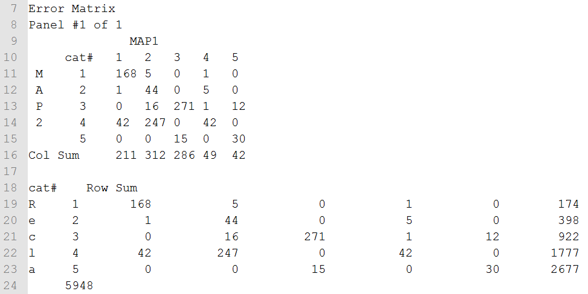
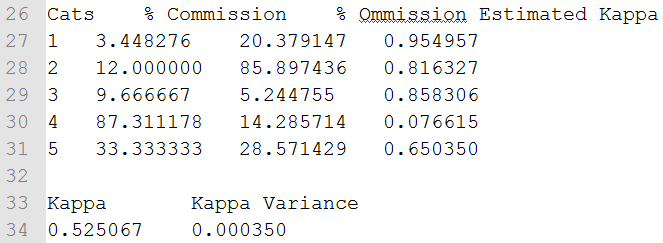

# GST 105: Introduction to Remote Sensing
## Lab 7: Accuracy Assessment
### Objective – Perform an Accuracy Assessment

Document Version: 8/27/2014

**FOSS4G Lab Author:**
Richard Smith, Ph.D.  
Texas A&M University - Corpus Christi

**Original Lab Content Author:**
Nathan Jennings

---

Copyright © National Information Security, Geospatial Technologies Consortium (NISGTC)

The development of this document is funded by the Department of Labor (DOL) Trade Adjustment Assistance Community College and Career Training (TAACCCT) Grant No.  TC-22525-11-60-A-48; The National Information Security, Geospatial Technologies Consortium (NISGTC) is an entity of Collin College of Texas, Bellevue College of Washington, Bunker Hill Community College of Massachusetts, Del Mar College of Texas, Moraine Valley Community College of Illinois, Rio Salado College of Arizona, and Salt Lake Community College of Utah.  This work is licensed under the Creative Commons Attribution 3.0 Unported License.  To view a copy of this license, visit http://creativecommons.org/licenses/by/3.0/ or send a letter to Creative Commons, 444 Castro Street, Suite 900, Mountain View, California, 94041, USA.  

This document was original modified from its original form by Richard Smith and continues to be modified and improved by generous public contributions.

---

### 1	Introduction

A primary aspect of image classification is to quantitatively validate the resulting land cover data set.  A common method to do this is to perform an accuracy assessment that uses an Error Matrix to compute a number of quantitative measures on the land cover data set.  For this lab, students will use a built-in accuracy assessment routine that functions within GRASS GIS.

This lab includes the following tasks:  

+ Task 1 – Review Input Data in GRASS GIS  
+ Task 2 – Run the Accuracy Assessment Tool  
+ Task 3 – Review and Interpret the Kappa Report  
+ Task 4 – Challenge: Improve the Supervised Classification

### 2	Objective: Perform an Accuracy Assessment

Students will an accuracy assessment routine to perform an accuracy assessment on a classified image.    The results will be reviewed and interpreted to determine how well the image classification performed.  The image classification has already be performed and the accuracy assessments sites required to compute the accuracy assessment is provided.

### 3	How Best to Use Video Walk Through with this Lab

To aid in your completion of this lab, each lab task has an associated video that demonstrates how to complete the task.  The intent of these videos is to help you move forward if you become stuck on a step in a task, or you wish to visually see every step required to complete the tasks.

We recommend that you do not watch the videos before you attempt the tasks.  The reasoning for this is that while you are learning the software and searching for buttons, menus, etc…, you will better remember where these items are and, perhaps, discover other features along the way.  With that being said, please use the videos in the way that will best facilitate your learning and successful completion of this lab.

### Task 1		Review Input Data in GRASS GIS

In this Task, we will quickly get familiar with the data that we will use to conduct an accuracy assessment.

2.	Open GRASS 6.4.3 GUI.  In Windows, this can be found at Start->All Programs->QGIS Chugiak->GRASS GIS 6.4.3->GRASS 6.4.3 GUI
3.	Set the ‘GIS Data Directory’ to <lab directory>\grassdata.
4.	Open the ‘user1’ mapset in the ‘AccuracyAssessment’ Location.
5.	Click File->Workspace->Open to open the ‘Choose workspace file’ dialog.
6.	Select <lab directory\grassdata\Lab7 Workspace.gxw’ and click ‘Open’ button.  This will load the workspace into the GRASS GUI.

A GRASS workspace is a file that stores the loaded map layers and display options.  A GRASS GIS workspace has been created for you that contains a small subset of a Landsat TM image (displayed as a RGB using bands 4,5,3 respectively) as well as a classified image (MLClass), and a reclassified image (Reclass_ML).  

The Reclass_ML contains five land cover types:  
1.	Agriculture  
2.	Water  
3.	Grassland  
4.	Forest  
5.	Urban

7.	Right-click on Reclass_ML then choose ‘Histogram’ from the contextual menu.  This will open the Histogramming Tool (d.histogram) displaying how many instances of each cell value are contained in the raster map (shown in the figure below).

The value of each contains the unique land cover values that correspond to the individual land cover information classes.

The MLClass file represents a typical output from the maximum likelihood image classification (i.maxlik) where every spectral class is categorized in the output. The Reclass_ML file is the recoded version of the ML_class where the spectral classes have been recoded to the five information classes shown above.

Reclass_ML is the image that will be used in the accuracy assessment.

In addition to the images, two raster maps are provided.  The Spectral_Sigs_Raster raster map represents the sites that were used to generate the training sites that were used to produce the MLClass.  The AA_Sites_Raster are the accuracy assessment areas and will be used in the accuracy assessment.

8.	Take a few moments to view the histograms for each raster map.  Make sure you understand the relationship between the raster maps and how the reclassified raster maps (AA_Sites_Raster, Reclass_ML) relate to the original classification output (MLClass) using the input training set (Spectral_Sigs_Raster).  Consider the number of training cells per class versus the number of classified cells per class.

### Task 2		Run the Accuracy Assessment Tool

In this task, we will run the accuracy assessment tool to generate an accuracy report.

1.	Click Imagery->Report and statistics->Kappa analysis [r.kappa].  This will open the kappa analysis tool.
2.	Set the following parameters:  
	+ Required tab:  
		+ Name … containing classification result: Reclass_ML  
		+ Name … containing reference classes: AA_Sites_Raster  
	+ Optional tab:  
		+ Name for output file…kappa: <lab directory>\KappaReport.txt  
3.	Click ‘Run’ button to execute the tool.
4.	If no errors are reported, click ‘Close’ button to close the r.kappa tool.

### Task 3		Review and Interpret the Kappa Report

In this task, we will open, review, and interpret the Kappa Report generated in Task 2 above.  

1.	Use a text editor (like Notepad) to open the created ‘KappaReport.txt’ to view the created report.

The first section (five lines in our case), shown in the figure below, display the header information identifying the title, location, date, mask, and input maps for the kappa analysis.

The second section (lines 7-24 in our case), shown in the figure below, displays the error matrix between Map1 (identified as AA_Sites_Raster in the header section) and Map2 (identified as Reclass_ML).

Let’s consider the error matrix for a moment (lines 9-16).  The columns are the reference data (the supervised classification we did by hand), while the rows are predicted classifications (classification done by the computer).  So, for example, if we look at the category 1 column, it reports that 168 cells were classified as category 1 when they were category 1 (so, classified correctly).  However, 1 cell was classified as category 2, when it was, in fact, category 1 (so, classified incorrectly).  Additionally, 42 cells were classified as category 4, when they were actually category 1 cells.

If we sum the diagonal (168+44+271+42+30), we get 555, which represents the number of cells that were classified correctly.  If we sum the Col Sum (211+312+286+49+42), we get 900, which represents the total number of reference cells (all considered to be correctly classified).  So, if we divide the number of cells classified correctly, by the number of reference cells, we get 555/900 = .6166, which represents a 61.66% accuracy rating of the unsupervised classification.  This is reported in lines 36-37 in the report  (shown in the figure below).  Essentially, this is the overall accuracy measure from the kappa report. 

If we just stopped reading the report at the Observation Percentage section, we would be missing an important section that will explain where the classification is getting poor results.  If we understand where the classification is getting confused, we can, perhaps, improve our training data to improve the overall accuracy.

Observe the Error Statistics section of our report (lines 26-34 in our report) shown in the figure below.

Consider the Percent Commission column (second column).  The percent commission reports what percentage of each class was confused with another class (i.e. misclassification percentage).  So, for example, class 4 (Forest) was confused with other classes 87.31% of the time!  Refer back to the Error Matrix section of the report (Figure 3) and look at the column for category 2 from Map1.  247 cells were mistakenly classified as class 4 (forest), when they were actually class 2 (Water).  Compared to the other classes, this percentage is very, very high, which explains a large percentage of our classification error. 

The Percent Omission column (third column) reports what percentage of each class was mistakenly classified as the wrong class.  Think of this column as the opposite case from the Percent Commission column.  For each category row, Percent Commission reports how many cells were placed into its class incorrectly, where Percent Omission reports how many cells were not placed into its class correctly (placed incorrectly into other classes).

The third column represents the estimated kappa coefficient. The kappa coefficient is a statistical measure of agreement between two different classifiers of the same data (in our case, how well the training dataset and supervised classification agreed in their classifications).  The kappa coefficient takes in to account to the agreement of classification versus the possibility that the agreement is just from sheer chance (both classifiers are just randomly guessing the classes).  If the classifiers completely agree on all classifications, then kappa would equal 1.  If the classifiers do not agree other than what would be expected by sheer chance, then kappa would equal 0.  So, in our case, the kappa coefficient is reported as 0.525067 in line 34 of the report.  This could be considered a moderate amount of agreement between the two classifiers, however, there is no universally agreed-upon range of values that would consider a kappa coefficient to be excellent, good, moderate, poor, or otherwise.  Therefore, when reviewing the kappa coefficient, you should also wholly consider the report when determining whether the classification is acceptable enough for your purposes.

The remaining section of the report (lines 39-51) displays the category descriptions as provided in the raster maps.

### Task 4		Challenge: Improve the Supervised Classification

Now that you have assessed the kappa report and understand which classes are contributing the most error, create a new classification training set, and reclassify the tm_sacsub_group imagery.  Use as many training areas you see fit to get optimal results.  Reclassify the resulting classification and training data into the same five classes used for this lab (outlined in Task 1). 

Discuss the following:  
1.	Briefly describe your strategy in defining suitable training areas. Which classes did you pay particular attention to when choosing training areas?  Why?  
2.	Run a kappa report on your reclassified training and classified image.  Report your Percent Observed Correct value and your Kappa Coefficient.  Additionally, discuss how your report differed from the first report and explain why the reports differed based on how you chose your training areas.  
3.	(If you completed the Challenge Task in Lab 6): Compare your training strategy for this lab, versus the training strategy you undertook in the Challenge Task in Lab 6.  Did the kappa report change your strategy?  Run a kappa report on the classification you completed for the Lab 6 Challenge.  Compare the results with the kappa report from this Lab’s Challenge.

### 5	Conclusion

This completes the quantitative analysis of an image classification data set.  Students performed a simple image classification and were able to observe and interpret the overall accuracy measures of the supervised classification.

### 6	Discussion Questions

1.	Which class has the most confusion for a given column? How do you know?
2.	Which row (1-5) has the most confusion?  How do you know?
3.	Is there anything suspect about this error matrix?  Describe and explain.
4.	Given the accuracy assessment outlined in Task 3, would you think the accuracy assessment is valid and useable?  Why or why not?  Justify your answer.
5.	Submit your answers to the Task 4 questions.
